# CRIM: MuseScore to MEI

Last Update:  December 2025

- Guidelines for Editors preparing MuseScore Files
- Exporting from MuseScore to MEI 
- Post Processing with [MEI Tools](https://github.com/RichardFreedman/mei_tools/blob/main/README.md)
- [MuseScore Handbook](https://handbook.musescore.org/)

## Table of Contents
- [Introduction](#introduction)

## Author

- Richard Freedman (Haverford College, USA)

## What are MEI Tools?

- [MEI Tools](https://github.com/RichardFreedman/mei_tools/blob/main/README.md) are a set of Python scripts that transform the flat MEI files produced by `sibmei` or `MuseScore` as rich MEI files.   
- MEI Tools are modular:  various functions can be included/excluded depending on the required output. These include:
    - editing metadata
    - removing and correcting music features such as inicipts, lyrics, musica ficta, etc.
- In [The Lost Voices Project](digitalduchemin.org), several related staves in flat MEI became single staves in rich MEI, using a combination of details already present in the original Sibelius file to determine the encoding.
- In [Citations:  The Renaissance Imitation Mass (CRIM)](crimproject.org) the rich encoding is limited mainly to musica ficta, which is marked in red in the Sibelius, but massaged as <supplied> in the MEI

## Preparing MuseScore Editions for MEI: Engraving and "E" Files!

- In this guide we describe the best practices for preparing MuseScore files for export to MEI, and subsequent processing with MEI Tools to produce rich MEI files suitable for analysis and digital editions. 

### As detailed below, there are various steps that need to be taken in MuseScore to prepare a file for export to MEI.  These include:
- adding the CRIM Style Sheet and Musica_ficta_color plug-in to your MuseScore installation
- initial import of MusicXML to MuseScore (if you are adapting previous work)
- apply CRIM Style Sheet
- add metadata
- rename parts
- update clefs
- adjust durations
- reset time signatures
- hide time signatures as needed for engraving
- correct rhythmic groupings and stem directions
- review accidentals; encode musica ficta and color notes that require musica ficta
- add or correct lyrics
- export to MEI and PDF
- post process with MEI Tools

## Preparing MuseScore Editions for MEI:  One File Does It All!

- Unlike the process for Sibelius files, MuseScore does not require separate "E" files for MEI export.  The same MuseScore file can be used both for engraving (PDF export) and for MEI export.

## Details of the Steps Mentioned Above

- The following sections provide more details and screenshots for the key steps mentioned above.

### Adding the CRIM Style Sheet to MuseScore

- You will need the `crim_2025.mss` style sheet for MuseScore; download it from the MEI Tools repository.
- Add it to the `MuseScore 4 > Styles` folder on your machine.
- As explained below, you can apply this to one score, or set as a default for all scores.

### Adding the Musica_ficta_color Plug-in to MuseScore

- You will also need the `musicaFicta_color.qnm`; download it from the MEI Tools repository.
- Add it to the `Musescore 4 > Plugins` folder on your machine.
- Install the `Musica_ficta_color` plug-in in MuseScore using the `Plug-in Manager` in MuseScore.
- You can also define a keyboard short-cut that will make it easier to use.

### Importing from MusicXML to MuseScore

- This is done using MuseScore `File > Open` menu, selecting the MusicXML file as the source.
- Alternatively, you can drag and drop the MusicXML file onto the MuseScore application icon or window.

### Applying CRIM Style Sheet for MuseScore MEI Export

The style sheet makes sure that each file follows the same overall layout, design, and choice of fonts.

- Download the `crim_25.mss` Style Sheet for MuseScore from this repository, as explained above.

You can associate this style sheet with your MuseScore files in one of two ways.  

A. With a given score open, you can open `Format > Load Style` menu:

 

> 

> 
Show Image

> 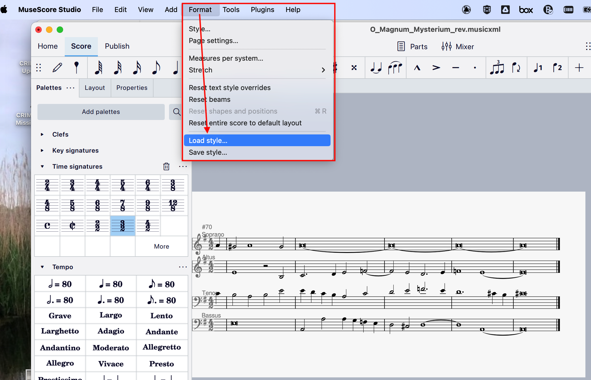
>
> 

 

And now 'apply' the style sheet to this score:

 

> 

> 
Show Image

> 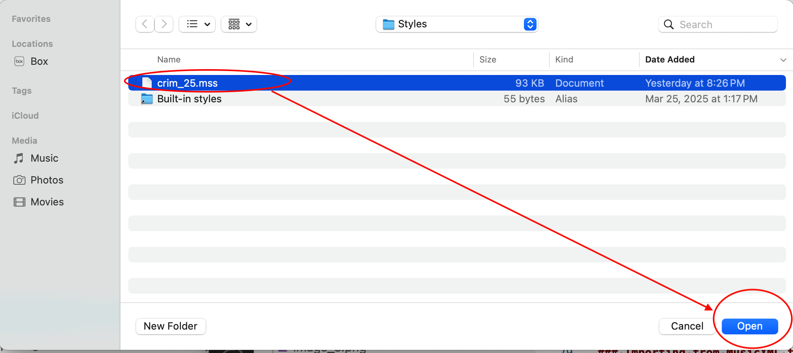
>
> 

 

B. Alternatively you can set the style sheet as the default for all new MuseScore files:

Set your `crim_25.mss` as the default:

`MuseScore > Preferences`, then under `Import`, choose the relevant `crim_2025.mss` file from the MuseScore 4 Documents folder on your computer.

Here is how do to this:

Open `MuseScore > Preferences`:

 

> 

> 
Show Image

> 
>
> 

 

Now the `Import` dialogue: 
 

> 

> 
Show Image

> 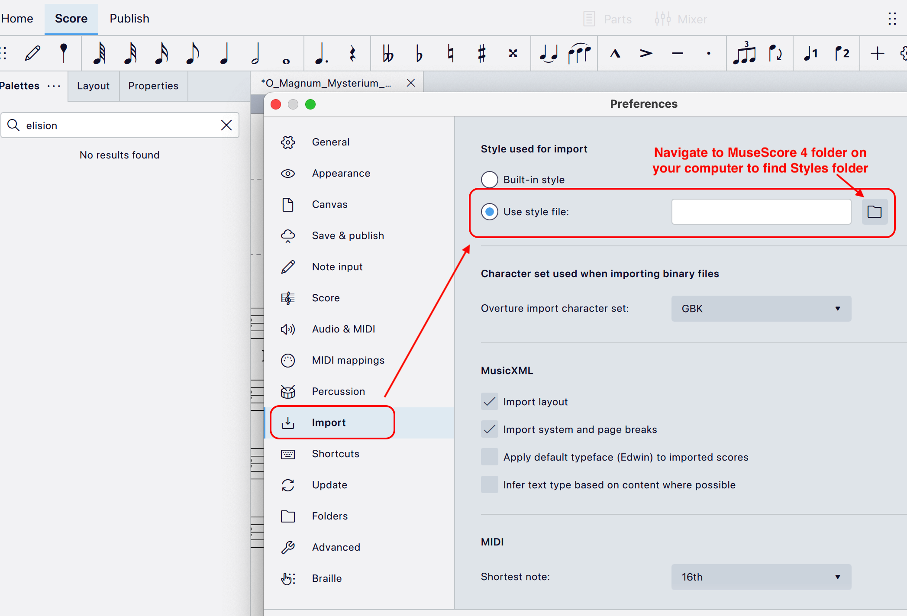
>
> 

 

And finally, find the `MuseScore 4 Documents` on your machine and select the `crim_2025.mss` file.

 

> 

> 
Show Image

> 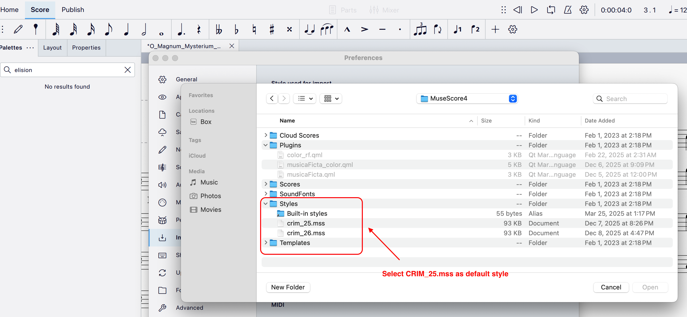
>
> 

 

### Adding Metadata in MuseScore

- Use MuseScore `File > Project Properties` menu to add **composer, title, and copyright** information.
- These will be included in the exported MEI file (which we nevertheless can curate further with MEI Tools as needed)

- Sample copyright content:

    `© Centre d'études supérieures de la Renaissance | Haverford College | Heidelberg University | The CRIM Project (crimproject.org)\`

Click below to see the `Project Properties` menu:

 

> 

> 
Show Image

> 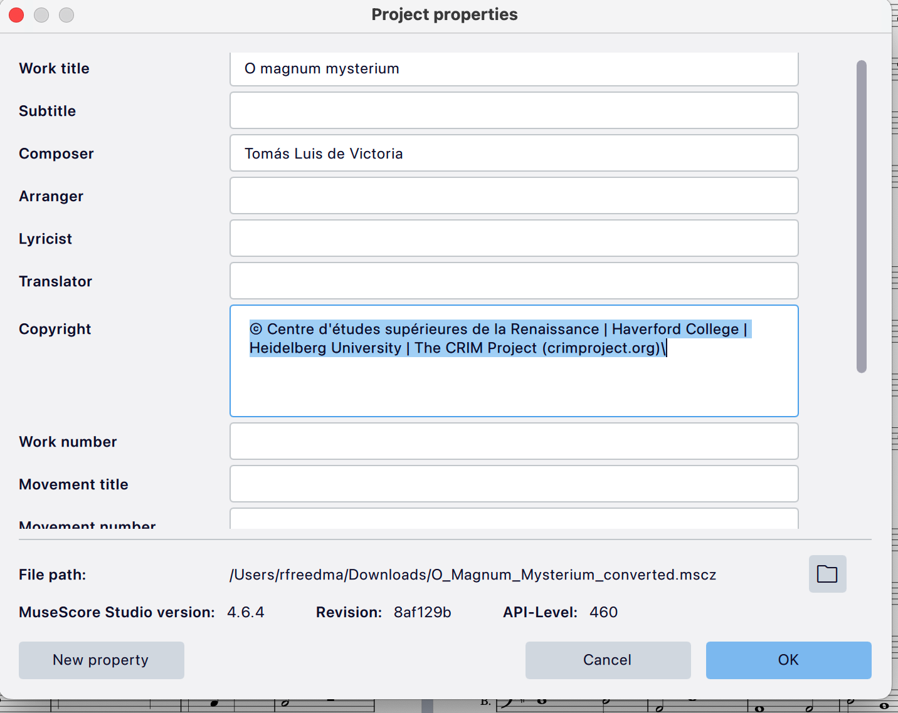
>
> 

 

Note that the **copyright** information will display in the MuseScore notation and PDF. But in order to display the **composer** and **title**, you will need to add these as **text objects** in the MuseScore file (using MuseScore `Add > Text > Title` and `Add > Text > Composer` menus), as shown below in the next section.

### Add Composer and Title Text Objects in MuseScore
- Use MuseScore `Add > Text > Title` and `Add > Text > Composer` menus to add text objects for composer and title in the score.
- This ensures that the composer and title are visible in the MuseScore notation and PDF export.

 

> 

> 
Show Image

> 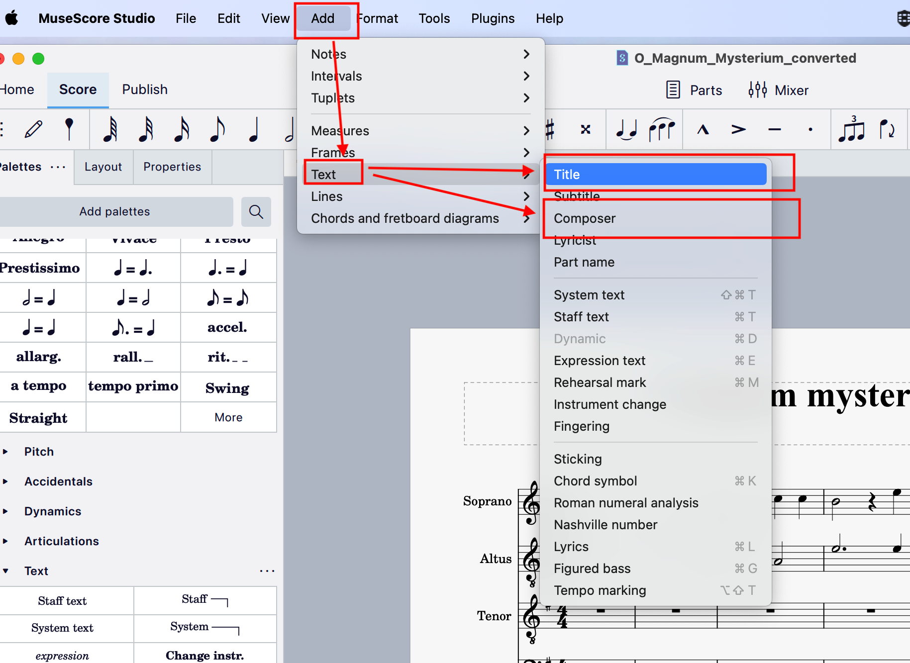
>
> 

 

Enter the title and composer in the respective text objects:

 

> 

> 
Show Image

> 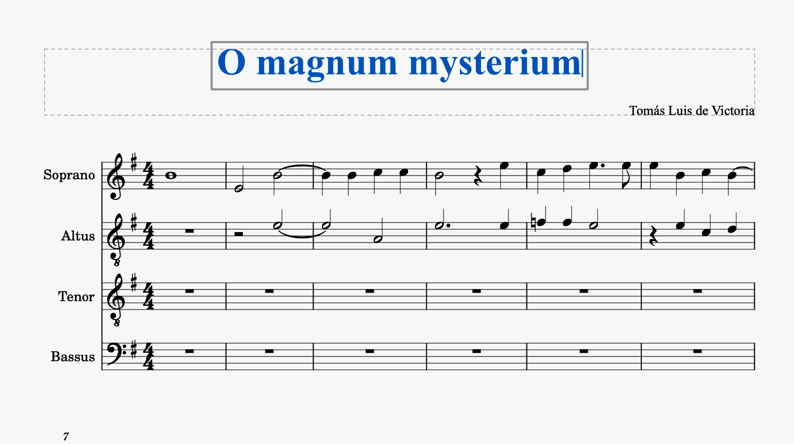
>
> 

 

The final result will look like this:

 

> 

> 
Show Image

> 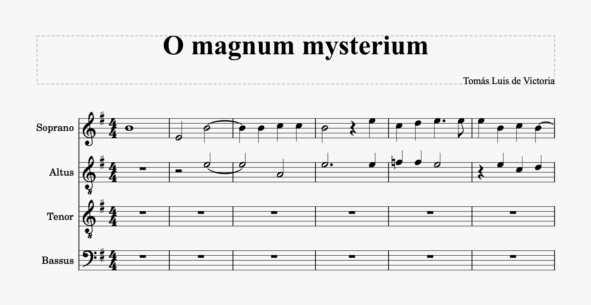
>
> 

 

## Staves

- Make sure the vocal parts are correctly named.  Normally these will follow the original source.
    - If the source does not provide a name for a given part, use “[  ]” to indicate an unnamed part.
    - If the source gives two voices the same name (for instance, two "Tenor" parts), then distinguish them as "Tenor [1]" and "Tenor [2]".
- To change the part name in MuseScore, **double click on the staff name**, then use the **replace instrument** button to select an appropriate part name from the **vocals** section.
- You can then edit the display name to match the original source.  The 'long instrument name' will be used on the first staff; the  'short instrument name' will be used on subsequent staves.
    - Remember that each part name should be **unique** within the score.  This will ensure that the MEI export correctly distinguishes between different parts.  So if you have two Tenor parts, be sure to rename them as "Tenor [1]" and "Tenor [2]" (or similar).

The first staff dialogue in MuseScore looks like this, and is where you can edit the display name:

 

> 

> 
Show Image

> 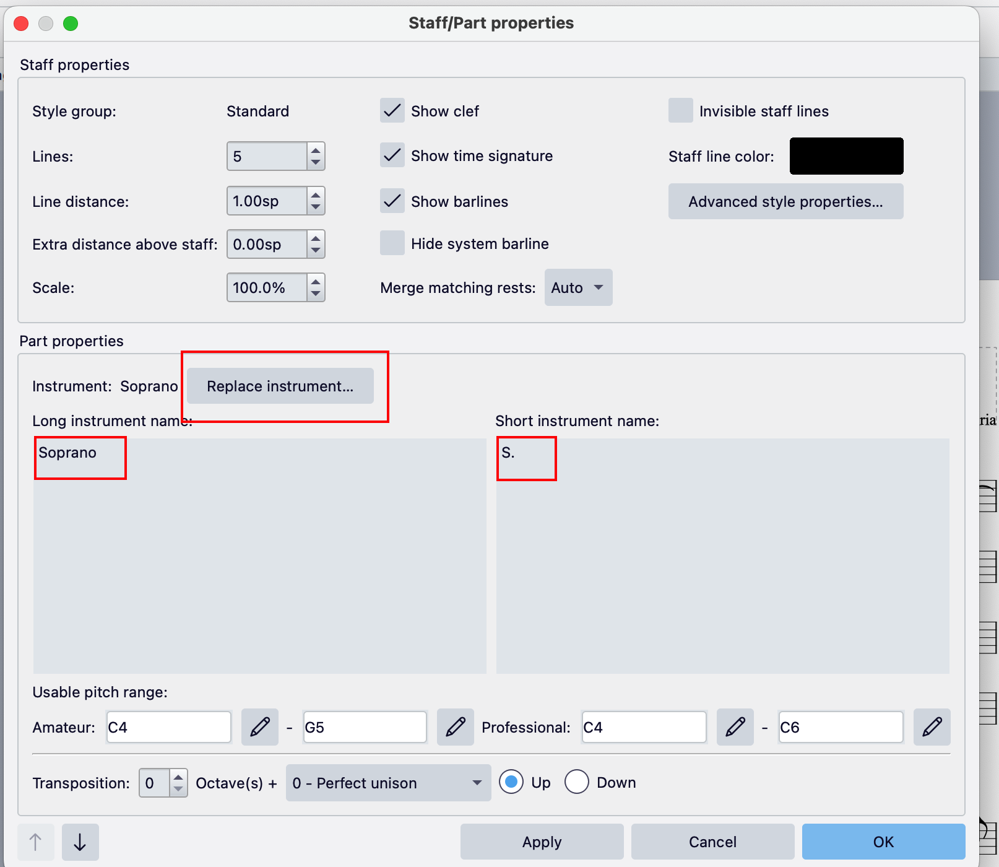
>
> 

 

Here is the second dialogue, where you can select the vocal part type:

 

> 

> 
Show Image

> 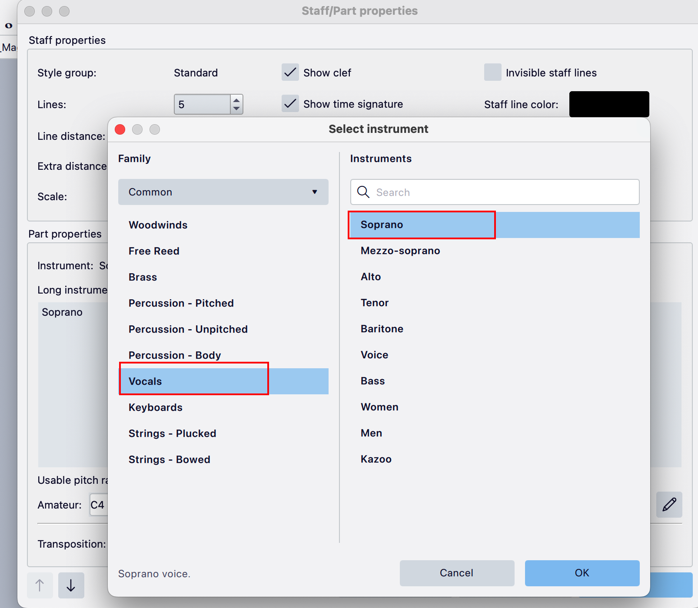
>
> 

 

## Brackets

Add staff brackets to group related staves together.  This is done using the `Palettes > Brackets` menu in MuseScore.

 

> 

> 
Show Image

> 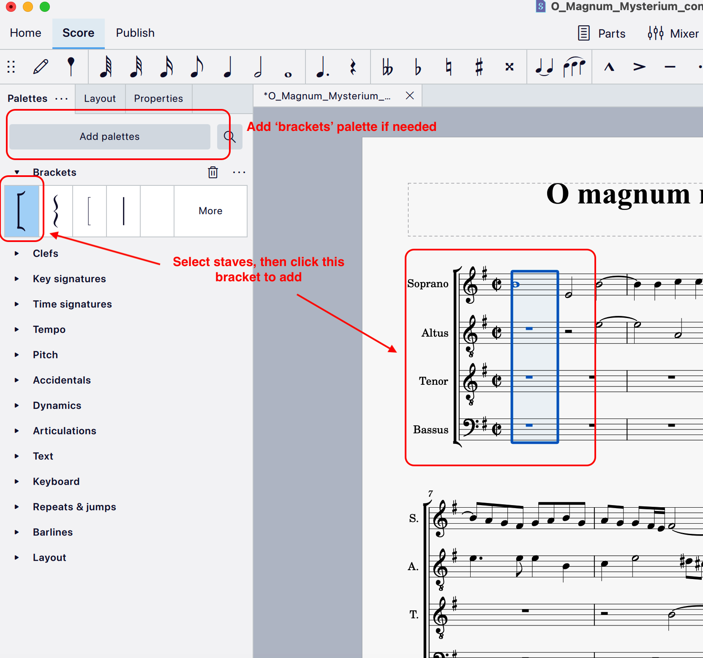
>
> 

 

## Clefs

- Make sure the clef for each part matches the range of that part.
- To change the clef in MuseScore, first **select the clef you want to change**, then use the `Palettes > Clefs`
- In MuseScore, unlike Sibelius, the G8va clef will export correctly to MEI, with the appropriate octave shift.

Now the staff is renamed:

 

> 

> 
Show Image

> 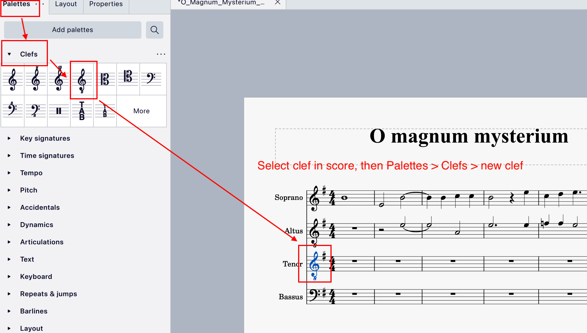
>
> 

 

## Incipits + Measure Numbers

- In the CRIM Project we do not include incipits in the PDF.  But if you want to include one for other purposes incipit (if you use one) must be a separate bar, and must be numbered "0". incipit = bar 0, first true measure = bar 1
- MEI Tools provides module to retain or remove incipit
- The bar numbers in the original MuseScore file determine those retained in the MEI file during sibmei export
- For Mass movements:  use **continuous bar numbers for each movement** (Kyrie, Christe, and Kyrie should be a single file with continous bar numbers)

## Adjusting Durations and Time Signatures to Match Original Notational Values

### Double the Durations

- CRIM uses **unreduced note values**
- If your MusicXML import has reduced note values, you will need to double the durations of all notes and rests to match the original notational values.  Here is how to do this in MuseScore:
    - `select all notes/rests in score` (Ctrl + A or Cmd + A)
    - `Edit > copy` (Ctrl + C or Cmd + C)
    - MuseScore `Edit > Paste double duration` (Ctrl + Shift + V or Cmd + Shift + V)
- Important: if your piece has **more than one time signature**, you will to do this in sections rather than the entire score at once.  You will need to: 
    - 1) **count the number of measures in the section for a given time signature** then 
    - 2) `select` the last bar in that section, and 
    - 3) `add` that number of empty measures to the end of the section using MuseScore `Add > Measures > Insert` after selection.  
    - 4) `copy` all the notes in the original section and then `Edit > paste double duration`.  
- Be sure to review the entire section to ensure that all durations are correct, then move on to the next step ("Correct the Time Signatures")
- Note that after this step you will also want to reset the rhytyhmic groupings and stem directions after adjusting durations (see below).

### Correct the Time Signatures

- After adjusting durations, you will need to **reset the time signatures to match the actual count of notational values in each bar**.
- Normally you will have bars like `4/2` and `3/1`, which will correspond to `Cut C` and `3` in the original source.
- To do this in MuseScore, **select** the given time signature, then use MuseScore `Palettes > Time Signatures` menu to set the correct time signature.

Here is the Time Signatures palette in MuseScore:

 

> 

> 
Show Image

> 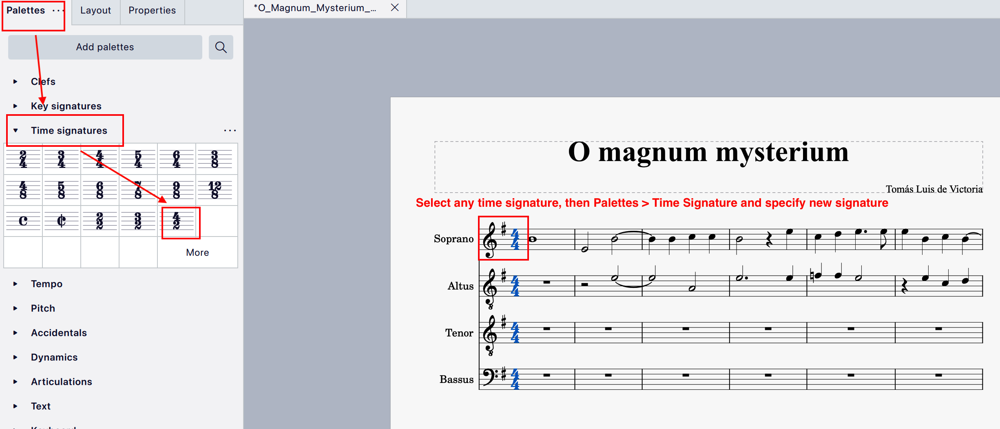
>
> 

 

- Note that if you have **multiple time signatures** in your piece, you will need to do this for **each section** separately, as noted above in `Double the Durations`.
- MEI Tools and MEI Tools record the time signatures as  **meter.unit** and **meter.count** attributes as part of the `scoreDef` and `staffDef` elements.  Having these correctly recorded (and corresponding to the actual count of beats in each measure) ensures that CRIM Intervals will correctly understand and analyize durations. 
- As explained below, you can nevertheless hide time signatures as needed for PDF engraving while retaining the correct underlying time signature for MEI export.

### Hide/Show Time Signatures for Engraving

- In CRIM, our policy is to display `Cut C` (alla breve) and `3` in the engraved PDF output, even as the underlying MEI file encodes these bars as `4/2` and `3/1`.  
    - As noted above, this is required for correct rhythmic interpretation with CRIM Intervals.  Verovio renderings of the MEI will also display the time signatures as `4/2` and `3/1`.
- Here is how to do this in MuseScore:
    - **right click (or Alt + click) on the time signature**, then adjust the `Time Signature Properties` to 'cover' it with a new symbol, such as `Cut C` or `3`.  The underlying actual meter will not be effected by this change, but the engraved PDF will display the desired symbol.
 

Select a time signature to 'cover' for engraving

 

> 

> 
Show Image

> 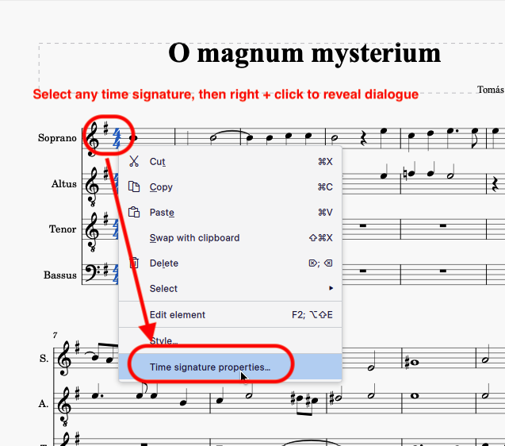
>
> 

 

And now select the desired symbol to cover the time signature:

 

> 

> 
Show Image

> 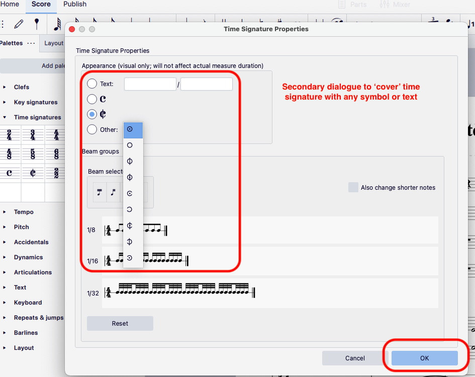
>
> 

 

The final result will look like this in the engraved PDF:

 

> 

> 
Show Image

> 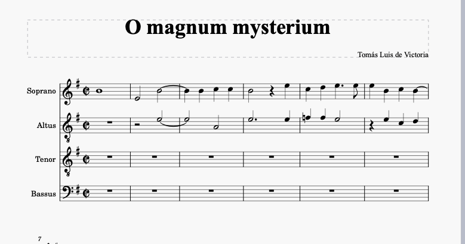
>
> 

 

### Reset Rhythmic Groupings and Stem Directions as Needed

MuseScore provides a tool to reset rhythmic groupings and stem directions after adjusting durations.  Tied notes within a bar will be grouped together (as longer values or dotted notes), and stem directions will be set according to standard engraving conventions.

To do this in MuseScore:
- `select all notes/rests in score` (Ctrl + A or Cmd + A)
- then use MuseScore `Format > reset shapes and positions` menu.

See below for screenshots of this process.

 

> 

> 
Show Image

> 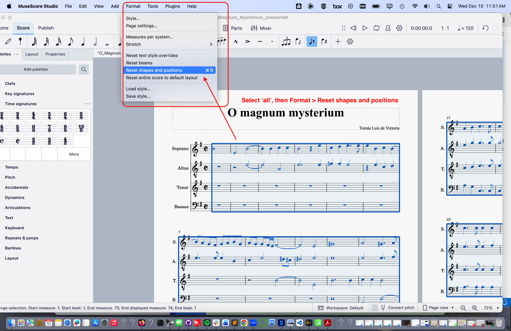
>
> 

 

And now the result after resetting shapes and positions:

 

> 

> 
Show Image

> 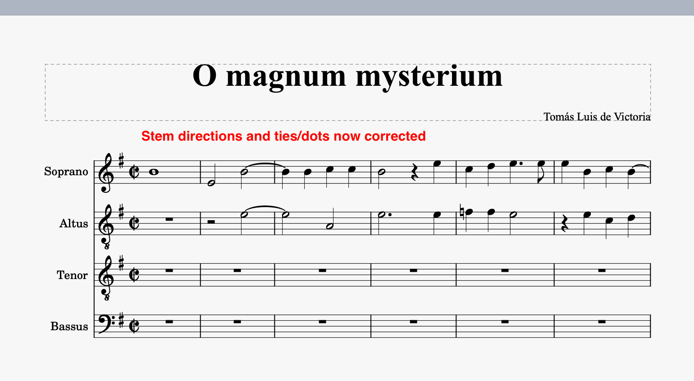
>
> 

 

## Review Accidentals; Encode Musica ficta and Color Ficta Notes 

Accidentals that appear in the original sources are recorded without special editorial commentary in our transcriptions.  Simply **select the notehead in question** and use the MuseScore `Palettes > Accidentals` menu to add the appropriate accidental, or simply use the main toolbar, as shown here:

 

> 

> 
Show Image

> 
>
> 

 

But other accidentals are **editorially supplied**.  In CRIM MuseScore and Sibelius files, these are recorded in red above the staff, and are exported to MEI as with this highlight.  MEI Tools converts all accidentals that appear in association with red notes into `<supplied>` elements in the MEI file.

Here is now to do this in MuseScore:

- Make sure you have added the `musicaFicta_color.qnm` to the `Plugins` folder in `MuseScore 4`, as explained above.

- *For each note that requires musica ficta*:
    - select the note and (if it's not already marked) add the accidental on the staff using MuseScore `Palettes > Accidentals` menu or the main toolbar
    - make sure the same note is selected, and then use `Plugins > Music/arranging tools` menu to select the `musicaFicta_color` function.  This will move the accidental to show *above* the staff and simultaneously color the given note red (if still selected it will appear to be blue, but click away to see the red highlight)
    - consider creating a custom keyboard shortcut for this plug-in to speed up the process.

The process will look like this:

 

> 

> 
Show Image

> 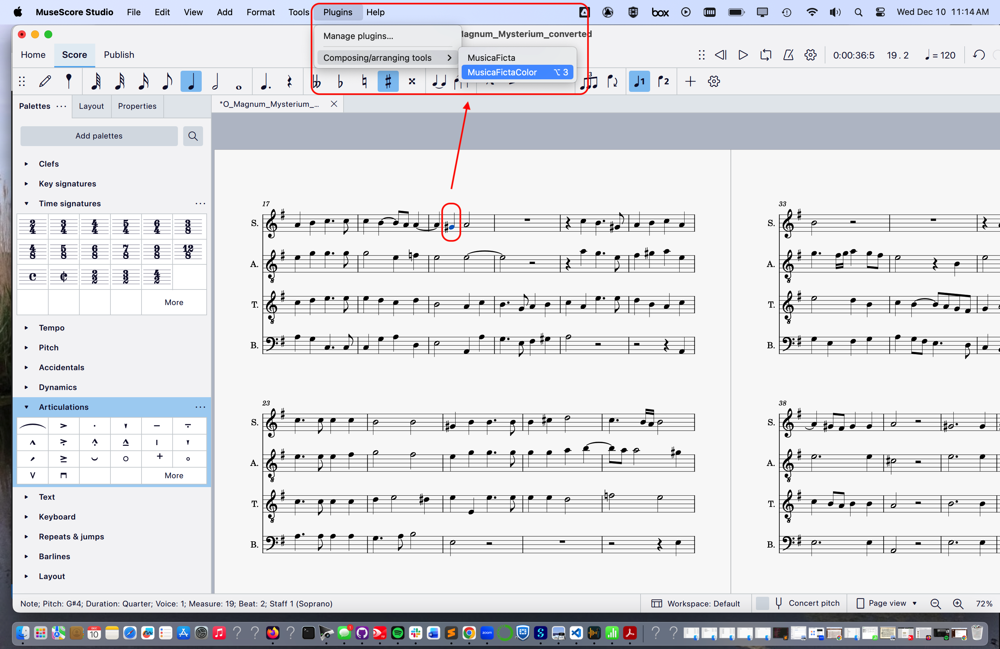
>
> 

 

And the result like this:

 

> 

> 
Show Image

> 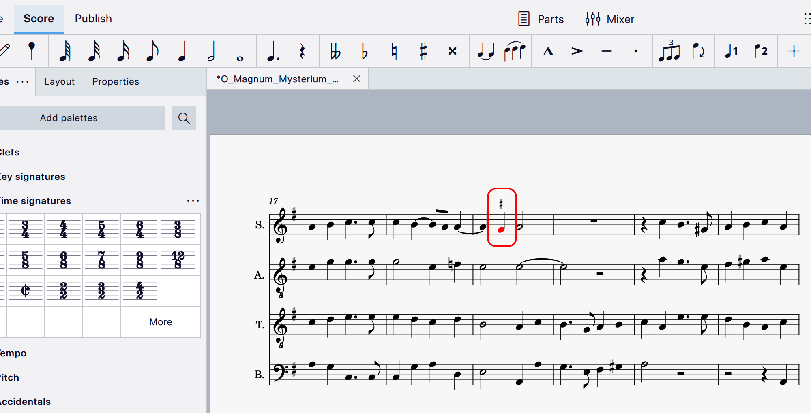
>
> 

 

## Add or Correct Lyrics

<!-- review this! -->
Carefully add lyrics to the score using MuseScore `Add > Text > Lyrics` menu. 

CRIM editions follow standard editorial practice for Renaissance music: 

- Phrases proceed syllabically, saving extra notes for the penultimate syllable of the line. The last note of each phrase normally receives the last syllable of the poetic line.
- Repeated pitches normally imply a change of syllable, since to do otherwise would result in awkward vocal articulations.
- Semi-minims rarely receive their own syllable. The major exception to this guideline is the first note of a melismatic line of short notes (semi-minims), which often is marked with a new syllable. Otherwise the next syllable after that is reserved for the note _after_ the minim that follows this series. Thus the first minim after a series of short notes does not normally get a new syllable, nor should the intervening short notes. Except in pieces with a great deal of nonsense syllables or other declamatory gestures, singers were advised against putting a new syllable on each of a series of notes less than a semi-minim.
- Syncopations and melodic leaps are often good places to change syllables, particularly in long phrases.

**Elisions** (for instance between `ky-ri-e_e-le-i_son`) need to be treated with care.  It is possible to create a curved elision mark with MuseScore, but there are some problems with the alternatives:

Method 1: after the first syllable, you can press `CMD + OPT + '-'` (MacOS) or `CTRL + ALT + '-'` (Windows), then type the second syllable for the given note.  This results in the two syllables beneath the same note, separated by a blank space.  The MEI export direct from MuseScore nevertheless connects the two syllables with a small curve when rendered in Verovio, but the PDF does not!

The resulting PDF:
 

> 

> 
Show Image

> 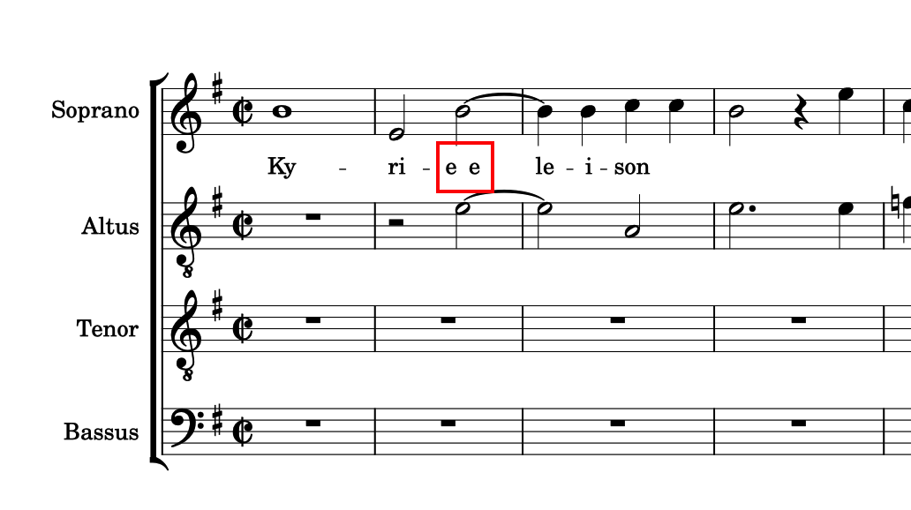
>
> 

 

The resulting MEI in Verovio:
 

> 

> 
Show Image

> 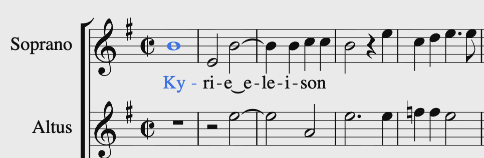
>
> 

 

Method 2:  after typing the first syllable, then `Right Click` to reveal the text edit dialogue, and select `Edit element`.  From here select `Add Symbols` dialogue and look for the small curving connector, which will be added to the score before the next syllable.  Here we see the opposite of the situation noted above:  the PDF has the curved connector, but the MEI displays things incorrectly.

The resulting PDF:
 

> 

> 
Show Image

> 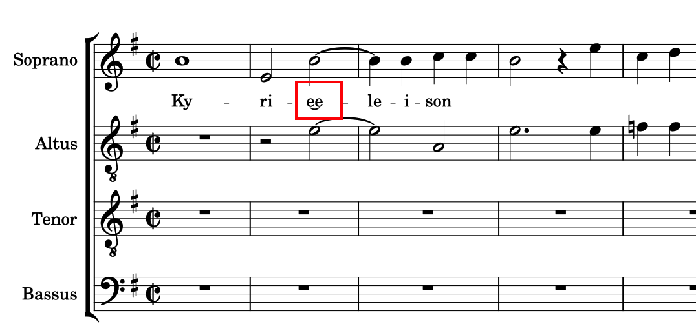
>
> 

 

The resulting MEI in Verovio:
 

> 

> 
Show Image

> 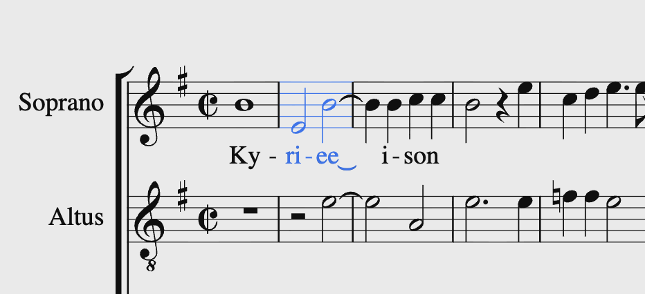
>
> 

 
<!-- get image for lyrics -->

## First + Second Endings

- In MuseScore First and second endings are created with `Palettes > Repeats and Jumps`

## Ligatures + Coloration

- CRIM editions do not use ligatures or coloration.  MuseScore does not support such brackets.

    
##  Metronome markings

- They are not used in CRIM editions. Delete them from any MuseScore file before export to PDF.
- We also check for and remove these from MEI files.

## MuseScore to MEI and PDF

- **export to MEI** using MuseScore `File > Export` menu, selecting `MEI` as the file type.  Note that we can also do this for a corpus of files with a command-line script using `mscore` (see [MuseScore Command Line Export](https://musescore.org/en/handbook/command-line-export) for details)
- **export to PDF** for engraving using MuseScore `File > Export` menu, selecting `PDF` as the file type.  Note that we can also do this with a command-line script using `mscore` (see [MuseScore Command Line Export](https://musescore.org/en/handbook/command-line-export) for details)