# CRIM: Sibelius to MEI

Last Update:  December 2025

- Guidelines for Editors preparing Sibelius Files
- Exporting from Sibelius to MEI with sibmei plugin
- Post Processing with [MEI Tools](https://github.com/RichardFreedman/mei_tools/blob/main/README.md)  

## Authors

- Richard Freedman (Haverford College, USA)
- Vincent Besson (CESR, Tours, France)
  
## What is the sibmei plugin?

- SibMEI is a Plug-in written for Sibelius Music Software.  More at [Sib-MEI on GitHub](https://github.com/music-encoding/sibmei)
- Exports Sibelius files as valid MEI files (single file or batch processing)
- One staff in Sibelius = one staff element in MEI
- Instrument names = staff definitions
- Supports most common notational symbols, lyrics, repeats, accidentals
- Supports color (which in the CRIM project is used to indicate ficta)
- Supports hidden time signatures (used to comply with CRIM standards for original mensuration values)
- Note:  Output of Sib>MEI requires further processing with MEI Tools  in order to create richly encoded MEI files, suitable for rendering with Verovio (see next slide)


## What are MEI Tools?

- [MEI Tools](https://github.com/RichardFreedman/mei_tools/blob/main/README.md) are a set of Python scripts that transform the flat MEI files produced by sibmei as rich MEI files.  See:  
- MEI Tools are modular:  various functions can be included/excluded depending on the required output. These include:
- editing metadata
- removing and correcting music features such as inicipts, lyrics, musica ficta, etc.
- In [The Lost Voices Project](digitalduchemin.org), several related staves in flat MEI became single staves in rich MEI, using a combination of details already present in the original Sibelius file to determine the encoding.
- In [Citations:  The Renaissance Imitation Mass (CRIM)](crimproject.org) the rich encoding is limited mainly to musica ficta, which is marked in red in the Sibelius, but massaged as <supplied> in the MEI


## Preparing Sibelius Editions for MEI:  Engraving  and "E" Files!

- Important:  You will in fact prepare TWO versions of the Sibelius file:
- An ‘engraver’ copy, which is used to make the final PDF
- An “e-file,” which is used to create the MEI version (this one contains some special treatment of musica ficta, and might remove incipits, etc.)


## A Minimal Example

- Here is a  minimal example prepared for sibmei, showing engraving and encoding guidelines for variants, emendations, reconstructions. 


## Metadata

- Piece title and metadata for Sibelius--add Movement for Mass!
- In the case of Mass movements, be sure to include the title of the movement in the title field: `Missa Ave maria:  Kyrie`

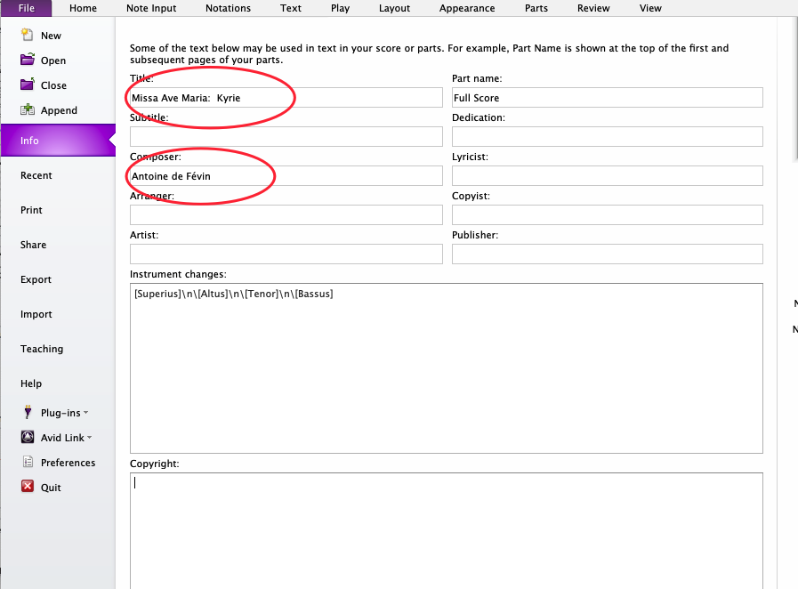


## Staves

- In order for MEI Tools to process your exported Sibelius files correctly:
- Part names must be Sibelius “instrument names,” not staff objects.
- Use name given in source.  If no name given, then use “[  ]”


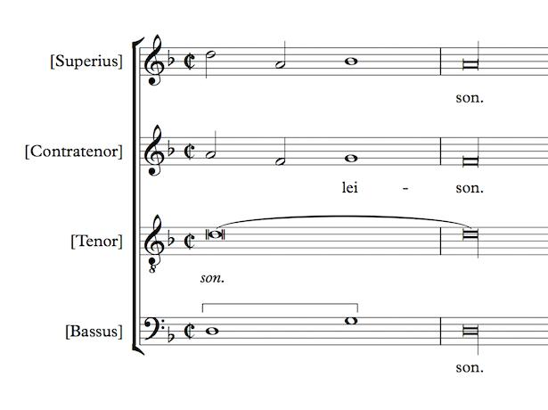


## Incipits + Measure Numbers

- Sibelius incipit (if you use one) must be a separate bar, and must be numbered "0". incipit = bar 0, first true measure = bar 1
- MEI Tools provides module to retain or remove incipit
- The bar numbers in the original Sibelius file determine those retained in the MEI file during sibmei export
- For Mass movements:  use continuous bar numbers for each movement (Kyrie, Christe, and Kyrie as a single file with continous bar numbers)
- Bar numbers can be switched on or off as part of Verovio (but not dynamically by the end user)


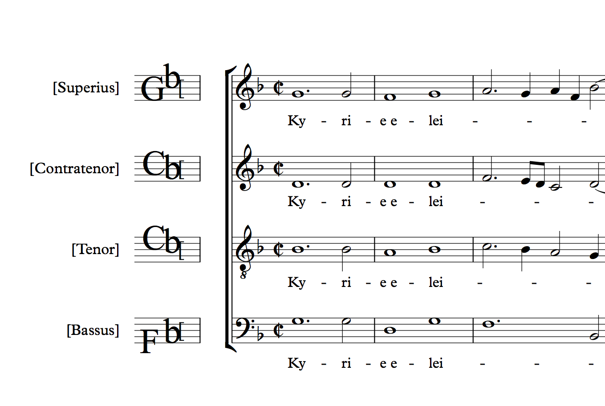


## First + Second Endings

- First and second endings are entered normally with Sibelius, from Notations>Lines.
- Measure numbers are continuous across the two endings.  Here:  first ending = 2, second ending = 3.

  
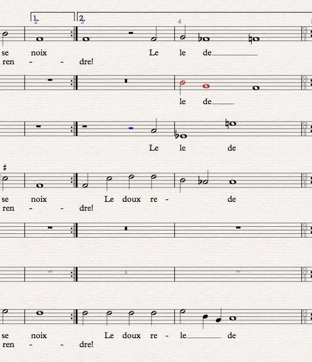

#### Find the first and second endings under the "Lines" menu . . .

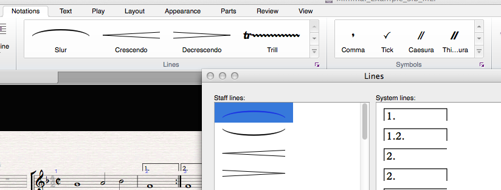


## Time Signatures

- CRIM uses unreduced note values
- Time signature should match the total of the notational values in a given bar
- MEI Tools ‘normalizes’ these the meter.unit and meter.count attributes according to your specified preferences.


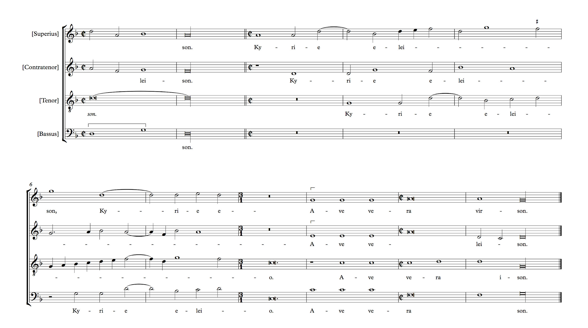


- If desired as part of original engraved Sibelius file, we can ‘hide’ the time signature and cover it with a symbol from Notations>Symbols menu in Sibelius.
- The resulting MEI will nevertheless retain the correct underlying signature after MEIMassaging. In these examples:  4/2 is the correct time signature, but we engrave as Cut C


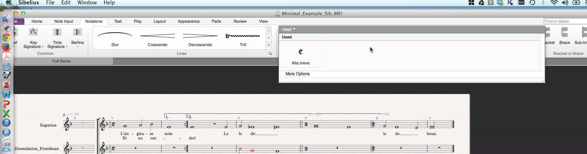

#### First “hide” the real time signature

- Next, select anywhere in the relevant bar and use Notations>Symbols to select the prefered engraving sign.  Repeat for each staff.

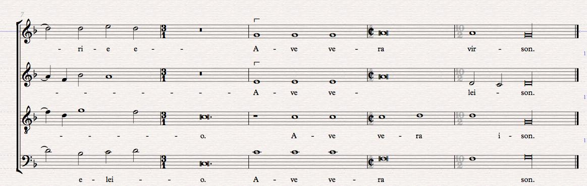


- “3/1” bars can be left as they are, or if you prefer, “hide” the 3/1 and engrave with “3” from Notations>Symbols


  
- Odd bars such as 10/2 (often at end of section) or 2/2 can be given their correct time but hidden, without the need to add engraved sign.

## Rests in 3/1 Bars

- In 3/1 bars, whole measure rests in a given part should be written as THREE SEMIBREVE RESTS, and not as a BREVE REST, since the latter will be incorrectly interpreted by some analysis software
- We can nevertheless check for these 'whole measure rests' and correct them with MEI Tools


### Accidentals + Musica ficta

- Accidentals on the staff are entered in the usual way
- For E-file only:  Musica ficta and other editorial accidentals above the staff:  color the note red, then use Sibelius standard plug in to “Add Ficta Above Note”.  (Find plug in via Notations menu)

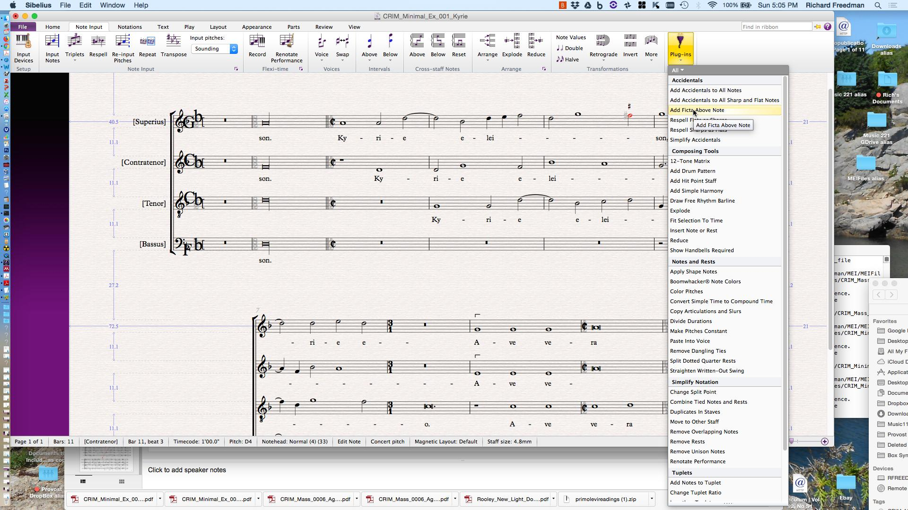

- Final output of MEIMassaging for a staff accidental: `<accid accid="f"/>`

- Final output of MEIMassaging for ficta above note:
```python
<supplied reason="edit">`
<accid accid="s" func="edit" place="above"/>
</supplied>
```


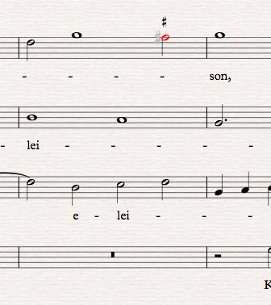


## Sib to MEI to Verovio

- Ficta note in red as part of E-file, then correctly rendered after processing


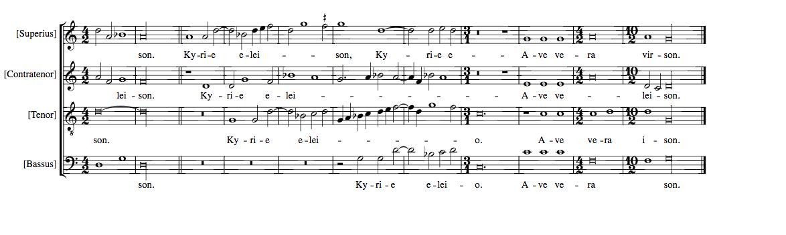


## Final longa

- In CRIM the final tone is entered in Sibelius as a longa (via the keypad).
- The extra line to create the longa is added as a symbol (line) for purposes of engraving. It does not export to MEI.
- In Du Chemin:  MEIMassaging converts final breve to final longa for purposes of the master MEI file.
- meiView nevertheless renders this as a breve in the present development.

- sibmei export produces breve: `<note dur="breve" oct="3" pname="d" >`

- MEIMassaging produces longa: `<note oct="3" pname="d" dur="long">`

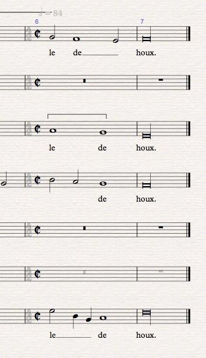


## Ligatures + Coloration

- Brackets used to indicate ligatures or coloration for engraved version are exported to MEI as annotations <annot>.
- These can be preserved or removed as with MEI Tools
- They are not supported in the current Verovio development

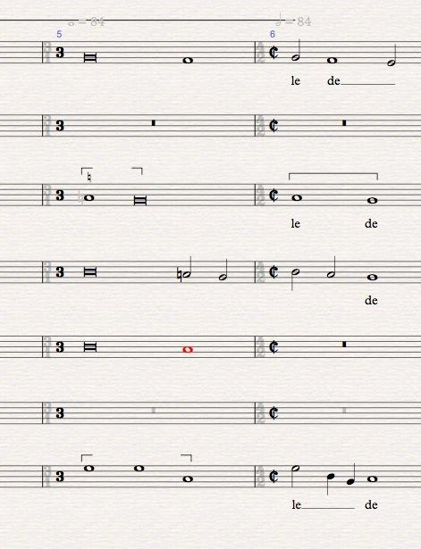

## Metronome markings

- Are hidden as part of engraving.
- They are retained in sibmei and in MEIMassaging, since they can be of use as part of MIDI renderings, but can be removed with MEI Tools.
- They are not supported in the current Verovio development.


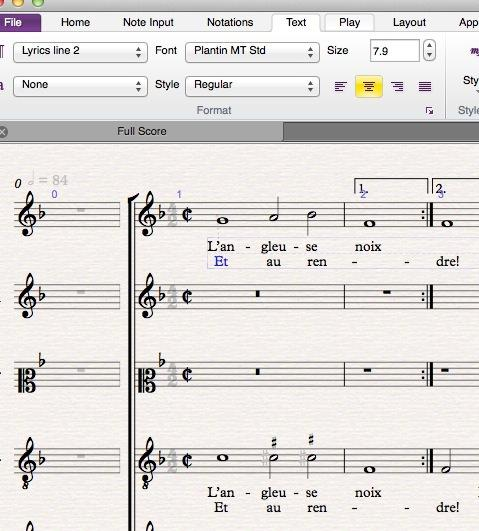

## Lyrics

- Be sure to encode second verse (if required) as “lyrics line 2”. If both sets of lyrics are encoded as Lyric 1, they will collide in meiView. (The results of sibmei and MEIMassaging will nevertheless be valid.)
- Be sure that each syllable is attached to a note (and never to a rest or barline). Syllables attached to rests or barlines will produce invalid MEI files after sibmei.
- Elisions (for instance between `ky-ri-e_e-le-i_son`) will be engraved by Sibelius with a small curving line.  Sib MEI exports these in a way that creates TWO syllables for a given note.  We correct these with MEI Tools to display as two syllables connected by an underscore (`_`)


